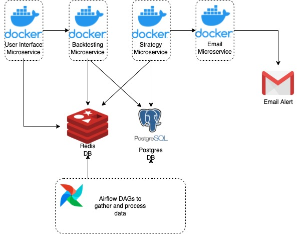

# Algo Trading
The goal of this application is two-fold:

1. To practice general python/systems engineering in a greenfield environment. Notably, the main patterns and use of interfaces ('repositories') come from the phenominal read [Architecture Patterns with Python](https://www.amazon.com/Architecture-Patterns-Python-Domain-Driven-Microservices/dp/1492052205).
2. To see if we can make a little money off the stock market. Yes, we know we should buy and hold VOO (which we do), but why not have a little fun in Robinhood like the rest of the Gen Z TikTok prodigies? 

This app is not an automated trading app. However, it does everything an automated trading system does *except* trade. Rather, the goal is to have an email subscription service by which information will be shared, i.e. "Now is a good time to buy stock **B** according to strategy **S**". Although it is now possible for the sub-par meme-stock middle-school retail investor to conduct automated day trading via [Alpaca](https://alpaca.markets/), we don't want [this](https://en.wikipedia.org/wiki/2010_flash_crash) to happen to our already-hurting portfolios.

Below you will find info on how to clone this repo, how things are organized, and things we plan to accomplish in the future.

Thank you for stopping by, hope you enjoy.

xoxo Gossip Girl

Ryan Lattanzi & Chris Mead

# Set Up Instructions

First, you must create a [github access token](https://docs.github.com/en/github/authenticating-to-github/keeping-your-account-and-data-secure/creating-a-personal-access-token#creating-a-token).

Then, clone this repo by running the following command in the terminal:
```
cd {directory/to/store/repo}
git clone https://github.com/ryanlattanzi/algo_trading
```
When prompted for username and password, paste the access token instead of the password. ([like here](https://docs.github.com/en/github/authenticating-to-github/keeping-your-account-and-data-secure/creating-a-personal-access-token#using-a-token-on-the-command-line))

To start your local environment, run the command
```
make start
```
which wipes the Docker volumes clean for a completely fresh start.

Now,
- Postgres should be running on port `5432` with name `algo_trading-postgres-1`
- PGAdmin should be running on port `80` (UI on `localhost:80`) with name `algo_trading-pgadmin-1`
- MinIO on port `9001` with name `algo_trading-minio-1` (UI on `localhost:9001`)
- Redis on port `6379` with name `algo_trading-redis-1`
- Notification Service on port `8000` with name `algo_trading-notification-1` (Swagger docs on `localhost:8000/docs`)

Finally, you must create a `logs` folder under the directory `dags` and another one under `back_testing`.

# Running The App

For now, there are 2 entrypoints into the system: `dags/orchestrate.py` which runs all of the DAGs in succession, and `back_testing/sma_cross_backtest.py`. The directory `algo_trading` includes all the source code that both entrypoints make use of. Within `back_testing/config`, `dags/config`, and `email_service/src`, you will find configuration values to bootstrap the entrypoints with which tickers to analyze, which database backend to use, etc.

For now, the best way to execute the program is `make test-integration` for dev purposes. It will run `orchestrate.py` to populate the database, `sma_cross_backtest.py` to backtest a given ticker over time, and `./bin/test_notification.sh` to send a few curl commands to the notification service. More specific unit tests are on the agenda...

Importantly, in order to ensure that the microservices are using the most up-to-date code in `algo_trading`, you should run `make dist`, which will generate a whl file in `./dist` and reference that file in each of the Dockerfiles. We aren't worried too much about package versions for now...but that's on the list. (If you desire to change the package version, just peep `setup.py` in the root dir.)

For prod, please see the next section on how we plan on making this more beefy.

# Future Endeavors

- As stated above, we plan to make these entrypoints more robust than your elementary `python3 data_pull_dag.py` commands by perhaps deploying the `dags` folder to an Airflow environment (or maybe something more compact and cheaper...) and Dockerizing the `back_testing` folder as a microservice.
- As it stands, we currently only have the Simple Moving Average (SMA) strategy. We want to add more strategies obviously, and we tried to architect the system such that the strategies have a fixed input and output (by using interfaces) so that they can be plugged in simply by a change of configuration.
- Create a subscription UI that allows users to select tickers that they are interested in monitoring. To determine the appropriate strategy, we will recommend one (based off past price movement, back-testing all strategies and choosing the one that performs best, or some other method) or have the user manually choose one. It should be entirely possible to analyze a given ticker with more than one strategy. Users should also be able to toy around with backtesting the strategies here.
- Transition some of these pieces to Golang and GRPC to make it faster.

# Proposed Architecture

System architecture is not our forte, but here is a stab. The UI, backtester, strategy calculations, and email service are each their own microservices.

- The UI connects to Redis and the backtesting service. This is where users will be able to sign up for email alerts as well as tinker with back testing various stocks with various strategies. It will also summon the backtester if a new stock is requested to be tracked by a user.
- The Backtesting service connects to both Postgres and Redis and analyzes historical performance given a ticker and strategy. The date from which to start backtesting is also an input.
- The Strategy service is similar, but does not run a historical test. Rather, based off of up-to-date daily data stored in both Postgres and Redis, it analyzes what behavior should be taken that day according to the strategy, and triggers an email.
- The email service will be a fairly simple API that will shoot emails to all folks subscribed to a given stock if the strategy finds it time to take action (buy/sell).
- Redis will keep track of which stocks are currently being tracked, who is subscribed to what stocks and strategies, which strategy is best for each stock, and various strategy-specific data to make the strategy microservice calculations possible.
- Postgres simply holds daily price data for each stock. Enriched data includes 7, 21, 50, 100, and 200-day moving averages. These are computed by the data pulling DAGs.
- DAGs pull price data and do simple calculations necessary for various strategies. This data is stored in both postgres and redis.



# Useful Git Commands

- Typical workflow for setting up a new branch:
```
git checkout master
git pull
git checkout -b {new/branch/name}
```

- After doing your work for the branch, we need to push it to the remote repo and create a pull request:
```
git checkout {branch/name}
git add -A
git commit -m 'commit message to describe changes'
git push

[git push might ask you to --set-upstream in order to
push your local branch to the remote branch]
```

- Now, in the github console, you should see an indicator that you recently pushed your branch to the repo. It will give an option for you to create a pull request, which you should do and request review from the other hitta.
